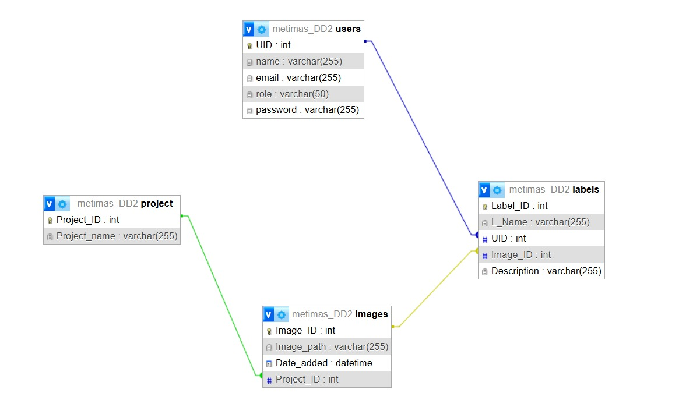

# image_annotation

This is my app


## Group Members

- Sumanth Metimath
- Pooja Joijode

---
## Initialization Scripts

This project uses separate initialization files for the database and the Python app:

- `create_table.sql`  
  SQL script that only **creates the tables** without inserting any demo rows.  
  Use this if you want a clean, empty database and plan to upload your own projects/images.

- `init.sql`  
  SQL script that **creates** the main tables (`users`, `project`, `images`, `labels`) and also **inserts sample data** (projects, images, labels with timestamps).  
  Run this on your MySQL database so the app has data to show on first run.


- `init.py`  
  Python initialization module for the application. This file is part of the project package and is imported when the app starts; it can be used for common setup logic and shared configuration.

### How to initialize the database

1. Create a MySQL database for the app.
2. Run **either**:
   - `create_table.sql` – creates tables only.
3. Update your `config.yml` (from `config_example.yml`) with the correct DB name, user, and password.
4. Start the Flask app:

   ```bash
   python app.py


## Relational Schema



## App Purpose & Narrative

This project is a small, full-stack web application for **image annotation** with a built-in **analytics dashboard**.

Typical workflow:

1. **Admin** creates users and uploads images into named **projects**.
2. **Annotators** log in and use a simple web UI to:
   - Pick a project,
   - View each image,
   - Enter a **label name** and **description**.
3. The app tracks which images are labeled vs. unlabeled and exposes:
   - Per-project completion status,
   - Which users have contributed the most labels,
   - The most frequent labels across the system.
4. Admins can export annotations per project as **CSV, JSON, or ZIP of images + metadata**.

The goal is to mimic a lightweight labeling tool that could be used to prepare data for machine learning or other downstream analytics.

---

## Users, Roles & Example Credentials

The app has two roles:

- **admin** – full control of the system.
- **customer** – annotator / regular user.

These roles are stored in the `users` table (see schema below) and checked in the Flask routes and templates (e.g., only admins see **Manage Users** and **Admin Dashboard**).

### Role & Credential Table


| Role     | Purpose / Capabilities                                                                 | Example Email              | Example Password |
|----------|----------------------------------------------------------------------------------------|----------------------------|------------------|
| `admin`  | Manage users, upload images, view all projects, access admin analytics dashboard, export annotations. | `admin@example.com`       | `Admin123!`      |
| `customer` | Log in, view assigned projects, annotate images (create/update labels), search and edit their labels. | `annotator@example.com`   | `Annotator123!`  |


---